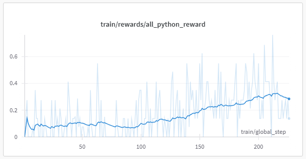
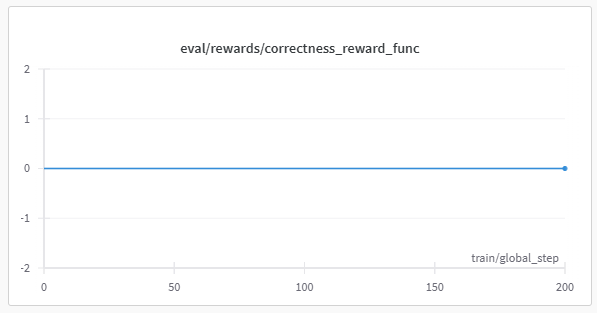
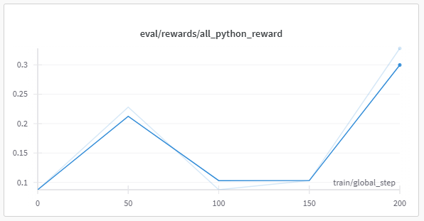

# Preliminary Training Results

This document summarizes the preliminary results from training. The results are based on the latest training run and include both training and evaluation metrics.

## Training Rewards

**Metric:** `train/rewards/all_python_reward`

- The training reward shows a clear upward trend, indicating that the model is learning to use the Python tool more effectively over time.
- There is significant variance in the reward, but the moving average demonstrates steady improvement.

## Evaluation Rewards

### 1. Correctness Reward Function

**Metric:** `eval/rewards/correctness_reward_func`

- The correctness reward remains flat at zero throughout the evaluation steps.
- Model might be too small to solve AIME2025.

### 2. All Python Reward

**Metric:** `eval/rewards/all_python_reward`

- The evaluation reward for all Python tasks shows some improvement, especially towards the later training steps.
- The reward increases sharply at the end, indicating potential learning, but the sample size is small and further training is needed to confirm this trend.

## Summary

- **Training rewards** are increasing, showing that the model is learning to use the tool during training.
- **Evaluation rewards** are mixed: the model shows some promise on the all Python reward, but not on the correctness reward function.
- **Next steps:**
  - Investigate the flat correctness reward (eval dataset might be too complicated for 0.5b model).
  - Continue training to see if evaluation rewards improve with more steps.
  - Eval with easier datasets

---

*Plots are generated from Weights & Biases logs